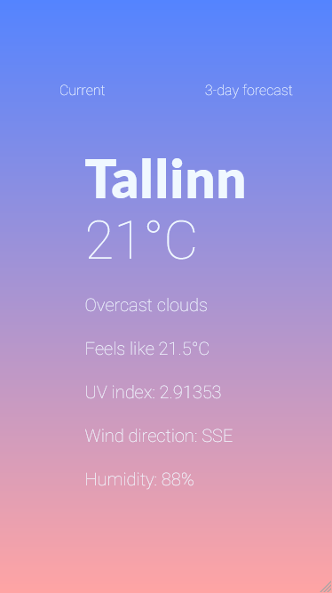

# weather

Weather forecast web application built with Vue.js. Shows current weather ~~(and up to 3-day forecast for now)~~.
Weather data from [weatherstack](https://weatherstack.com). Currently only works with one city, Tallinn.



## Project setup

```
npm install
```

### Compiles and hot-reloads for development

```
npm run serve
```

### Compiles and minifies for production

```
npm run build
```
